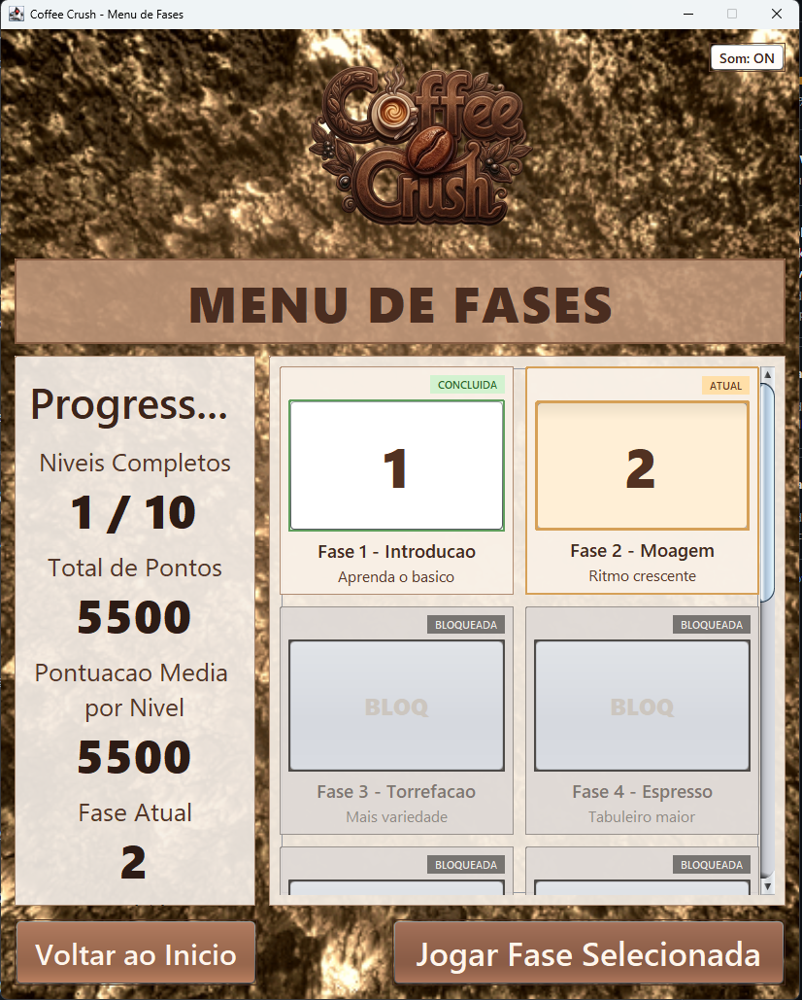
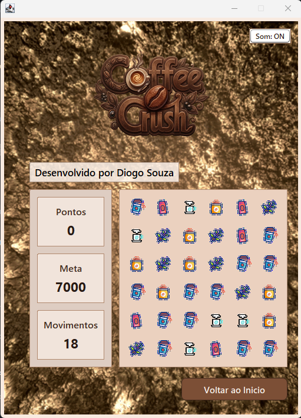

# ☕ Coffee Crush (sem-stress)

> Um jogo estilo **match-3** feito em **Java 8 + Swing**, com tema de café, fases configuráveis, animações, música e progressão com desbloqueio.

<div align="center">


</div>

---

## ✨ Visão geral
O **Coffee Crush** nasceu como projeto de estudo de lógica e foi evoluindo para um jogo completo, com:
- tabuleiro dinâmico
- fases desbloqueáveis
- animações de explosão e queda
- música por fase
- visual customizado em Swing

Nossa intenção é simples: **aprender, evoluir e divertir**. 🚀

---

## 🖼️ Galeria (espaços para suas imagens)
Use esta seção para encantar quem abrir o repositório.

### 📸 Menu de fases
> Coloque sua imagem em: `docs/images/menu-fases.png`

```md

```

### 📸 Tela de jogo
> Coloque sua imagem em: `docs/images/tela-jogo.png`

```md

```

### 📸 Match com explosão
> Coloque sua imagem em: `docs/images/explosao-match.gif`

```md

```

### 📸 Fluxo completo (menu -> fase -> game over)
> Coloque sua imagem em: `docs/images/fluxo-completo.gif`

```md

```

---

## 🎮 Funcionalidades
- ✅ Match-3 com pontuação por combo (`match-3`, `match-4`, `match-5+`)
- ✅ Cascata de peças com animação
- ✅ Fases configuráveis por arquivo `.properties`
- ✅ Música de fundo por fase
- ✅ Menu de fases com bloqueio/desbloqueio
- ✅ Progresso persistido localmente
- ✅ Botão de som (ON/OFF)

---

## 🧱 Tecnologias
- **Java 8**
- **Apache Ant**
- **Java Swing**
- **JLayer** (suporte a MP3)
- **JUnit 4 + Hamcrest** (testes)

---

## 📁 Estrutura do projeto
- `src/com/semstress/` classes principais do jogo e telas
- `src/com/semstress/images/` assets visuais
- `src/com/semstress/audio/` músicas e sons
- `src/com/semstress/configuracao-jogo.properties` config base
- `src/com/semstress/fases.properties` catálogo e parâmetros das fases
- `save/progresso-fases.properties` progresso do jogador (gerado em runtime)
- `build.xml` build/execução com Ant

---

## 🛠️ Pré-requisitos
Antes de rodar:
- JDK 8 (com `java` e `javac` no PATH)
- Apache Ant (`ant` no PATH)
- libs em `lib/` (`jlayer`, `junit`, `hamcrest`)

---

## ⚙️ Instalação pelo terminal (Windows / PowerShell)

### 1) Instalar Java 8 (Amazon Corretto)
```powershell
winget install -e --id Amazon.Corretto.8.JDK
java -version
javac -version
```

### 2) Instalar Apache Ant (fonte oficial Apache)
```powershell
$ver = "1.10.15"
$zip = "$env:TEMP\apache-ant-$ver-bin.zip"
$url = "https://archive.apache.org/dist/ant/binaries/apache-ant-$ver-bin.zip"
$dest = "C:\Tools"

New-Item -ItemType Directory -Force -Path $dest | Out-Null
Invoke-WebRequest -Uri $url -OutFile $zip
Expand-Archive -Path $zip -DestinationPath $dest -Force

$antHome = "$dest\apache-ant-$ver"
[Environment]::SetEnvironmentVariable("ANT_HOME", $antHome, "User")
$userPath = [Environment]::GetEnvironmentVariable("Path", "User")
if ($userPath -notlike "*$antHome\bin*") {
  [Environment]::SetEnvironmentVariable("Path", "$userPath;$antHome\bin", "User")
}
```

Feche e abra o terminal, depois valide:
```powershell
ant -version
```

### 3) Baixar libs externas (Maven Central)
Na raiz do projeto:
```powershell
New-Item -ItemType Directory -Force -Path .\lib | Out-Null
Invoke-WebRequest "https://repo1.maven.org/maven2/javazoom/jlayer/1.0.1/jlayer-1.0.1.jar" -OutFile ".\lib\jlayer-1.0.1.jar"
Invoke-WebRequest "https://repo1.maven.org/maven2/junit/junit/4.13.2/junit-4.13.2.jar" -OutFile ".\lib\junit-4.13.2.jar"
Invoke-WebRequest "https://repo1.maven.org/maven2/org/hamcrest/hamcrest-core/1.3/hamcrest-core-1.3.jar" -OutFile ".\lib\hamcrest-core-1.3.jar"
```

---

## ▶️ Como rodar
Na raiz do repositório:

```powershell
ant clean
ant compile
ant run
```

---

## 📦 Gerar JAR
```powershell
ant jar
java -jar .\dist\SemStress1.0.jar
```

---

## 🧪 Rodar testes
```powershell
ant test
```

---

## 🎚️ Configuração das fases
O arquivo `src/com/semstress/fases.properties` controla a progressão.

Exemplo:
```properties
fase.3.nome=Fase 3 - Torrefacao
fase.3.tabuleiro.linhas=6
fase.3.tabuleiro.colunas=6
fase.3.jogo.movimentos_iniciais=17
fase.3.jogo.meta_pontos=9000
fase.3.ui.recurso_background=/com/semstress/images/background.gif
fase.3.audio.recurso_musica_fundo=/com/semstress/audio/fur-elise.wav
fase.3.audio.volume_percentual=70
```

Também é possível sobrescrever por `config/fases.properties` sem recompilar.

---

## 💡 Dicas rápidas
- Trocar música da fase: `fase.<id>.audio.recurso_musica_fundo`
- Mutar fase específica: `fase.<id>.audio.habilitar_musica_fundo=false`
- Ajustar dificuldade: `movimentos`, `meta`, `linhas`, `colunas`, `tipos_peca`

---

## 👨‍💻 Autor
Desenvolvido por **Diogo Souza**, com foco em aprendizado prático, evolução contínua e um projeto que dá orgulho de mostrar. 🙌
