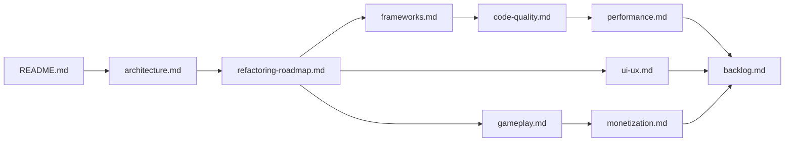

# Coffee Crush — Plano de Modernização

> Documentação completa de evolução do projeto **sem-stress** (Java 8 + Swing, desktop) para o **coffeecrush-mobile** (Kotlin + Jetpack Compose, Android), transformando o MVP em um jogo mobile moderno, escalável, testável e pronto para monetização futura.

**Data da análise:** julho/2026
**Escopo:** somente documentação — nenhuma alteração de código foi feita.
**Público-alvo:** desenvolvedores e modelos de IA (ex.: Claude Sonnet) que implementarão as melhorias. Cada documento é autocontido e possui contexto suficiente para execução independente.

---

## Estado atual (resumo executivo)

| Projeto | Stack | Papel daqui pra frente |
|---|---|---|
| `sem-stress` (raiz) | Java 8, Swing, Ant, NetBeans | **Referência funcional congelada.** Não evoluir. Fonte de regras de negócio e dos testes de engine (JUnit 4) a serem portados. |
| `mobile/coffeecrush-mobile` | Kotlin 1.9, Jetpack Compose, Material 3, minSdk 26 | **Projeto principal.** Toda a modernização acontece aqui. |

### O que já está bom no mobile (preservar)

- Engine match-3 portada de forma limpa e pura (`Match3Engine`, `Match3Board`), sem dependência de Android — excelente base para testes e para futura extração em módulo.
- Fluxo de animação modelado como dados (`AnimationRound` com frames) e não como efeitos colaterais na UI.
- Fases configuráveis via `.properties` com override em disco (balanceamento sem recompilar).
- UI declarativa em Compose com identidade visual de café já estabelecida.
- Suporte a toque e arraste (drag swap) no tabuleiro.

### Principais problemas encontrados (detalhados nos docs)

1. **Sem ViewModel / ciclo de vida:** `CoffeeCrushController` é uma classe comum com `CoroutineScope` próprio → estado perdido em rotação/process death, risco de vazamento. `[P0]`
2. **I/O síncrono na composição:** `StageRepository.load()` e `ProgressRepository.load()` rodam na main thread dentro de `remember {}` → jank/ANR. `[P0]`
3. **Zero testes no mobile** (o desktop tem testes de engine; o mobile, nenhum). `[P0]`
4. **Sem injeção de dependência, sem navegação estruturada** (troca de tela via `when`), sem `DataStore`, sem version catalog, sem CI, R8 desabilitado. `[P1]`
5. **Performance de renderização:** tabuleiro renderiza N×M composables com ticker global de sprite a cada 80 ms → recomposição do tabuleiro inteiro continuamente. `[P1]`
6. **Idioma misto no código** (`MusicaFundoPlayer` vs `StageRepository`), dificultando consistência e colaboração. `[P2]`
7. **Gameplay raso para os padrões do gênero:** apenas meta de pontos + movimentos; sem peças especiais, objetivos variados, estrelas ou retenção. `[P1 de produto]`
8. **Nenhuma preparação para monetização, analytics ou feature flags.** `[P2]`

---

## Índice dos documentos

| Documento | Conteúdo | Leia primeiro se você vai... |
|---|---|---|
| [architecture.md](architecture.md) | Análise da arquitetura atual dos dois projetos e arquitetura alvo (MVVM + camadas + módulos Gradle), com diagramas Mermaid e plano de migração incremental | ...refatorar estrutura, criar módulos, introduzir ViewModel/DI/Navigation |
| [refactoring-roadmap.md](refactoring-roadmap.md) | Todos os problemas encontrados com impacto, solução, esforço, prioridade, dependências e riscos; roadmap em fases | ...planejar sprints ou decidir ordem de execução |
| [frameworks.md](frameworks.md) | Cada framework/lib recomendada: por quê, problema que resolve, impacto de migração e prioridade | ...adicionar dependências ou atualizar toolchain |
| [code-quality.md](code-quality.md) | Convenções, estratégia de testes, análise estática, CI/CD e experiência do desenvolvedor (DX) | ...configurar qualidade, testes e pipeline |
| [performance.md](performance.md) | Diagnóstico de performance (renderização, memória, I/O, build) e correções com exemplos | ...otimizar FPS, memória e tempo de inicialização |
| [ui-ux.md](ui-ux.md) | Melhorias de menus, botões, animações, HUD, feedback, tipografia, cores, acessibilidade e usabilidade | ...trabalhar na interface e na identidade visual |
| [gameplay.md](gameplay.md) | Análise da jogabilidade e proposta de mecânicas originais, progressão, modos e retenção | ...evoluir o game design |
| [monetization.md](monetization.md) | Arquitetura de monetização desacoplada e desligada por padrão (feature flags), SDKs, LGPD, lojas e roadmap | ...preparar receita futura sem ativar nada agora |
| [ideas.md](ideas.md) | Banco de ideias de longo prazo (KMP/iOS, liveops, social, editor de fases...) | ...explorar visão de futuro |
| [backlog.md](backlog.md) | Backlog único consolidado, priorizado, com critérios de aceite e checklists | ...pegar a próxima tarefa e executar |

---

## Convenções usadas em toda a documentação

**Prioridade**

- `P0` — bloqueia evolução saudável; fazer antes de qualquer feature nova.
- `P1` — alto valor; fazer logo após P0.
- `P2` — importante, mas pode esperar um ciclo.
- `P3` — desejável / oportunista.

**Esforço** (estimativa para um dev experiente ou IA assistida)

- `P` (pequeno) — até ~meio dia.
- `M` (médio) — 1 a 3 dias.
- `G` (grande) — 1 semana ou mais / envolve mudança estrutural.

**Identificadores:** tarefas são referenciadas como `RR-nn` (refactoring-roadmap), `UX-nn`, `GP-nn` (gameplay), `MZ-nn` (monetização) etc., e consolidadas em [backlog.md](backlog.md).

---

## Ordem de leitura recomendada para implementação

**Regra de ouro:** o desktop Swing nunca é alterado; ele serve apenas de oráculo de comportamento (especialmente os testes em `test/com/semstress/`) até que o mobile tenha paridade + testes próprios. A partir daí, o mobile é a única fonte de verdade.
