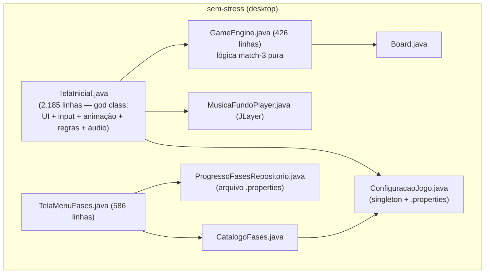
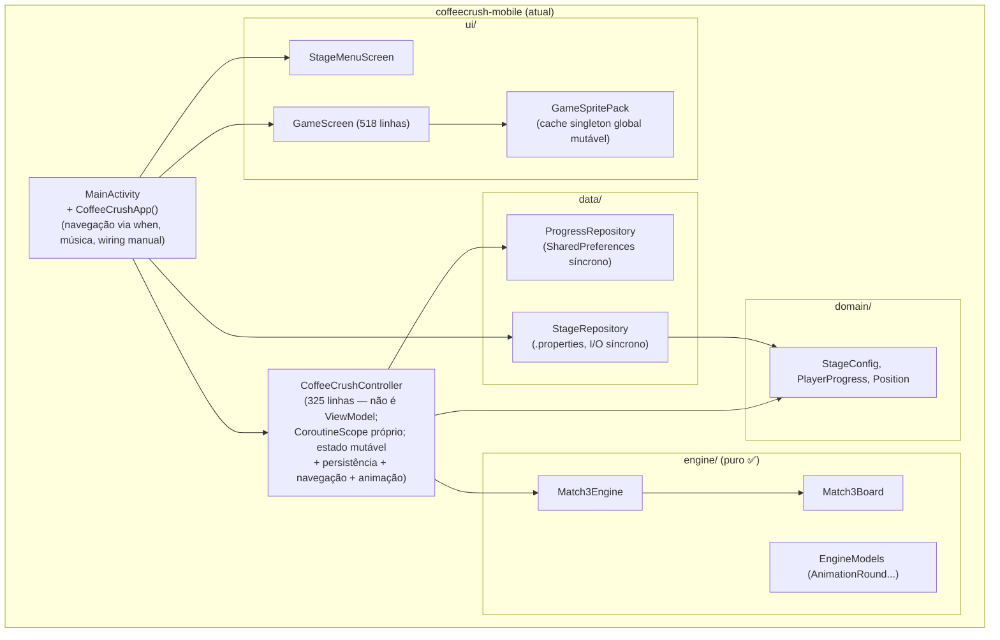
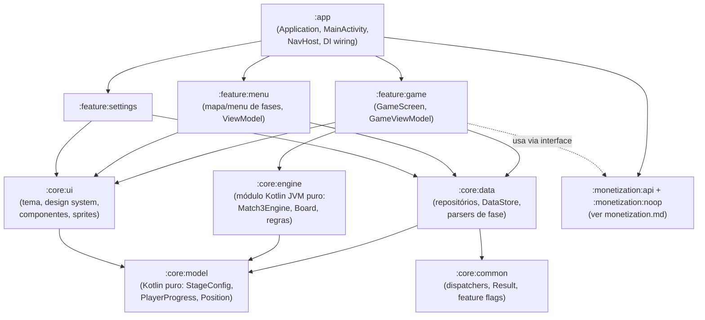
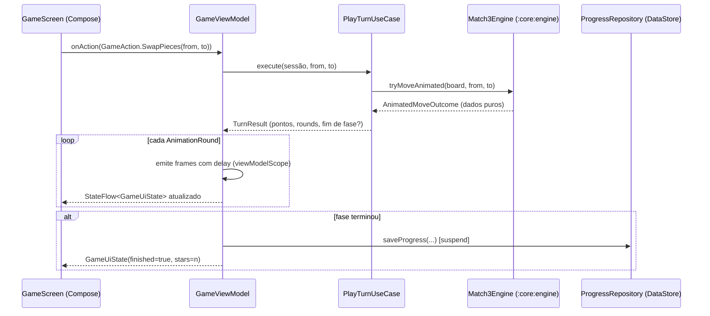
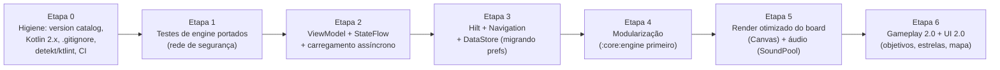

# Arquitetura — Análise e Plano Alvo

## 1. Arquitetura atual

### 1.1 Projeto legado (`sem-stress`, desktop)

Stack: Java 8, Swing, Ant + NetBeans (`build.xml`, `nbproject/`, arquivos `.form`), JLayer para áudio, JUnit 4.



**Diagnóstico:**

| Aspecto | Avaliação |
|---|---|
| Separação engine × UI | Parcial — `GameEngine`/`Board` são puros e testados; porém `TelaInicial` concentra orquestração, animação, timers Swing, som e navegação. |
| Testabilidade | Engine sim (6 classes de teste JUnit 4, incluindo cascata, pontuação e validação de movimento); UI não testável. |
| Padrões | Singleton (`ConfiguracaoJogo.get()`), timeline de animação como dados (`RodadaAnimacao`) — este último é um bom padrão que o mobile herdou. |
| Veredito | **Congelar.** Não vale modernizar Swing/Ant. Valor restante: (a) regras de negócio de referência; (b) testes de engine a portar; (c) assets. |

### 1.2 Projeto mobile (`mobile/coffeecrush-mobile`)

Stack: Kotlin 1.9.24, AGP 8.5.2, Compose BOM 2024.09, Material 3, minSdk 26 / target 34, `SharedPreferences`, `MediaPlayer`.



**Problemas estruturais (cada um vira tarefa em [refactoring-roadmap.md](refactoring-roadmap.md)):**

1. **Estado sem ciclo de vida (RR-01).** `CoffeeCrushController` vive dentro de `remember {}` na composição, com `CoroutineScope(SupervisorJob() + Dispatchers.Main.immediate)` próprio. Consequências: estado do jogo destruído em mudança de configuração (rotação, mudança de tema, resize em tablets/foldables) e em process death; o scope nunca é cancelado (vazamento); impossível testar sem Compose.
2. **I/O na composição (RR-02).** `StageRepository(appContext).load()` (leitura de assets + parsing de `Properties`) e `ProgressRepository.load()` executam sincronamente na main thread durante a primeira composição.
3. **Deus-estado (RR-03).** Um único `AppUiState` mistura navegação (`screen`), catálogo, progresso, música e estado da partida. Qualquer mudança recompõe consumidores de tudo.
4. **Navegação artesanal (RR-04).** `when (state.screen)` não dá back stack, deep links, transições, nem `SavedStateHandle`.
5. **Sem DI (RR-05).** Wiring manual em `MainActivity`; troca de implementações (fake/real) e testes ficam difíceis.
6. **Persistência primitiva (RR-06).** `SharedPreferences` com chaves soltas; sem migração, sem observabilidade (Flow), sem tipagem.
7. **Engine acoplada à animação (RR-07).** `AnimationRound` (frames de queda como snapshots completos do tabuleiro) vive na engine. Funciona, mas mistura domínio com apresentação e gera muitas alocações (ver [performance.md](performance.md)).
8. **Monólito de módulo único (RR-08).** Tudo em `:app`; engine pura poderia ser módulo JVM/KMP testável isoladamente e compilar mais rápido.
9. **Idioma misto (RR-09).** `MusicaFundoPlayer.tocarEmLoop()` convive com `StageRepository.load()`.

---

## 2. Arquitetura alvo

### 2.1 Decisões de alto nível (com justificativa)

| Decisão | Escolha | Por quê |
|---|---|---|
| Motor gráfico | **Manter Jetpack Compose** (não migrar para libGDX/Unity/Godot) | Match-3 é um jogo de UI: grade, cartas, diálogos, animações curtas. Compose entrega isso com DX muito superior, e a engine já é pura. Migrar de motor seria reescrita total sem ganho proporcional. Otimizações de render (Canvas único para o tabuleiro) resolvem o gargalo — ver performance.md. |
| Padrão de apresentação | **MVVM com UDF (Unidirectional Data Flow), estilo MVI-lite** — `ViewModel` + `StateFlow<UiState>` + eventos selados | Padrão oficial Android, ótimo suporte de ferramentas/testes (Turbine), preserva estado no ciclo de vida via `SavedStateHandle`. |
| Camadas | UI → ViewModel → UseCases (leves) → Repositories → DataSources; **engine como biblioteca pura de domínio** | Clean Architecture pragmática: use cases só onde há orquestração real (ex.: `PlayTurnUseCase`, `CompleteStageUseCase`); evita boilerplate cerimonial. |
| DI | **Hilt** | Padrão de mercado Android, integração com ViewModel/Navigation/WorkManager, verificação em tempo de compilação. (Koin é alternativa aceitável; ver frameworks.md.) |
| Navegação | **Navigation Compose com rotas type-safe** (kotlinx.serialization) | Back stack correto, argumentos tipados, transições, preparado para novas telas (config, loja, mapa). |
| Persistência | **DataStore (Proto ou Preferences+serialization)** para progresso/settings; Room só quando houver dados relacionais (ver ideas.md) | Assíncrono, transacional, exposto como `Flow`, com migração de SharedPreferences suportada. |
| Config de fases | **JSON versionado (kotlinx.serialization)** em assets, com override local e futuro Remote Config | `.properties` não tem tipos, listas nem aninhamento; JSON permite objetivos/camadas/obstáculos do novo gameplay e validação por schema. |
| Multiplataforma | **Não agora.** Estruturar `:core:engine` e `:core:model` sem dependência de Android para deixar a porta do KMP/iOS aberta | Custo baixo hoje, opcionalidade alta amanhã. |

### 2.2 Módulos Gradle alvo



Regras de dependência: setas só apontam "para baixo"; `:core:engine` e `:core:model` **não podem** depender de Android (`android.*`, `androidx.*`) — verificado por serem módulos `kotlin("jvm")`.

### 2.3 Fluxo de dados alvo (UDF)



Contratos sugeridos:

```kotlin
// :feature:game
sealed interface GameAction {
    data class SwapPieces(val from: Position, val to: Position) : GameAction
    data object Replay : GameAction
    data object BackToMenu : GameAction
    data object ToggleSound : GameAction
}

@Immutable
data class GameUiState(
    val stage: StageUi,
    val board: BoardUi,            // ver performance.md: células estáveis, não List<List<Int>>
    val score: Int,
    val movesLeft: Int,
    val phase: TurnPhase,          // Idle, Animating(round), Finished(result)
    val objectives: List<ObjectiveUi>, // preparado para gameplay.md
)

class GameViewModel @Inject constructor(
    savedStateHandle: SavedStateHandle,       // stageId da rota + restauração
    private val playTurn: PlayTurnUseCase,
    private val stageRepository: StageRepository,
    private val progressRepository: ProgressRepository,
) : ViewModel() { /* StateFlow + onAction() */ }
```

### 2.4 Estrutura de pacotes alvo (dentro dos módulos)

```
:core:engine        br.com.coffeecrush.engine        (Match3Engine, Match3Board, MatchFinder, Scoring, BoardShuffler)
:core:model         br.com.coffeecrush.model         (StageConfig, Objective, PieceType, PlayerProgress, Position)
:core:data          br.com.coffeecrush.data          (StageRepository, ProgressRepository, SettingsRepository, datastore/, parser/)
:core:ui            br.com.coffeecrush.ui            (theme/, components/, sprites/, audio/)
:feature:menu       br.com.coffeecrush.feature.menu
:feature:game       br.com.coffeecrush.feature.game
:monetization:*     br.com.coffeecrush.monetization  (ver monetization.md)
```

(Manter `com.semstress.mobile` como `applicationId` para não quebrar instalação; namespace de código pode divergir do applicationId.)

---

## 3. Plano de migração incremental (sem big bang)

A migração preserva o app funcionando a cada passo. Ordem e dependências detalhadas em [refactoring-roadmap.md](refactoring-roadmap.md).



Pontos de atenção da migração:

- **Etapa 2 é a mais delicada:** mover a lógica de `performMoveAnimated` do controller para o ViewModel mantendo os mesmos delays (`MATCH_HIGHLIGHT_MS=140`, `EXPLOSION_MS=220`, `FALL_FRAME_MS=65`). Escrever primeiro testes do controller atual (comportamento observável) e só então refatorar.
- **Migração de progresso do jogador:** ao trocar `SharedPreferences` → DataStore, implementar migração automática (`SharedPreferencesMigration`) preservando `highest_unlocked_stage`, `current_stage` e `stage_N_best_score`. Nunca resetar progresso de quem já instalou.
- **Migração `.properties` → JSON:** manter leitura dupla por uma versão (JSON com fallback para properties) e remover o formato antigo depois; o mecanismo de override em `files/config/` deve continuar funcionando.
- **Compatibilidade de comportamento da engine:** os testes portados do desktop (Etapa 1) são o contrato. Qualquer divergência intencional (ex.: novas peças especiais) entra como configuração nova, não como mudança silenciosa.
