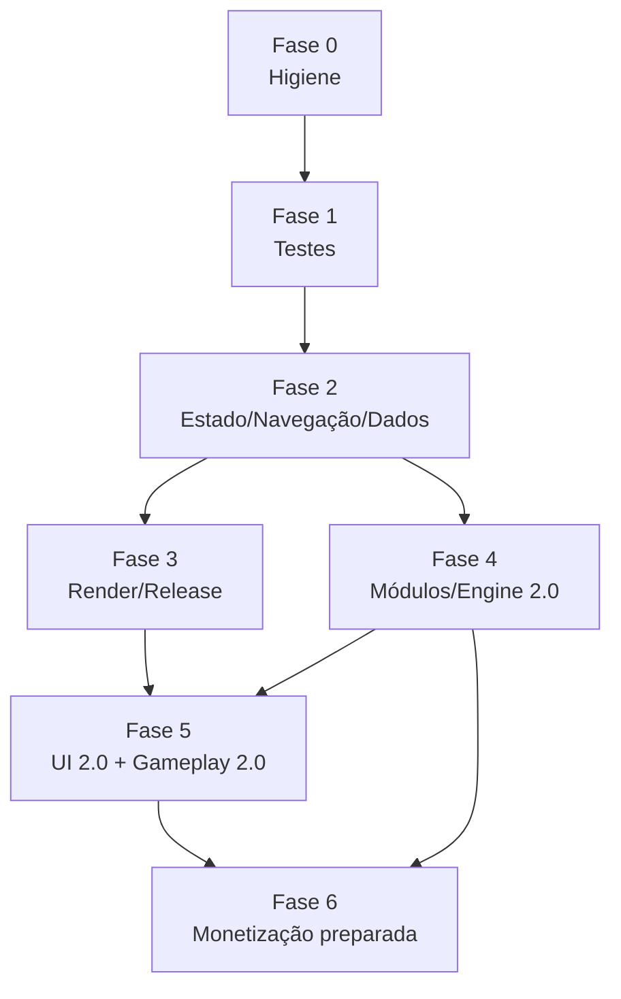

# Backlog Consolidado

Fonte única de execução. Cada item referencia o documento com o detalhamento completo. Ordem dentro de cada fase = ordem sugerida de execução. Marcar checkboxes conforme conclusão (respeitando o Definition of Done de [code-quality.md](code-quality.md) §6).

> Esforço: `P` ≤ ½ dia · `M` 1–3 dias · `G` ≥ 1 semana.

---

## Fase 0 — Higiene e toolchain (P0)

- [x] **RR-10** `P` — Limpar VCS: ignorar/remover `local.properties`, `.gradle-user/`, `.idea/` volátil, `build/`. *Aceite:* `git status` limpo após build; nenhum path de máquina no repo. ([roadmap](refactoring-roadmap.md))
- [x] **RR-11** `P` — Version catalog `gradle/libs.versions.toml` com todas as dependências. *Aceite:* nenhum literal de versão nos `build.gradle.kts`.
- [x] **RR-12** `M` — Kotlin 2.x + plugin Compose do Kotlin + AGP/BOM atualizados. *Aceite:* `composeOptions.kotlinCompilerExtensionVersion` removido; app roda; build verde.
- [x] **RR-14** `M` — CI GitHub Actions (build + detekt + lint + unit tests, `working-directory` no projeto mobile). *Aceite:* PR com teste falhando fica vermelho. ([code-quality](code-quality.md) §4)
- [x] **CQ-01** `P` — detekt + ktlint/formatting + lint baseline configurados localmente e no CI.

## Fase 1 — Rede de segurança (P0)

- [x] **RR-19** `M` — Portar as 6 suítes de teste de engine do desktop para JUnit 5 (cascata, pontuação, validação, shuffle, board/seed) + helper `boardFrom(String)`. *Aceite:* cenários equivalentes ao desktop passando; `:app` (futuro `:core:engine`) ≥ 90% de cobertura na engine. ([code-quality](code-quality.md) §2.2)
- [x] **CQ-02** `M` — Testes de caracterização do `CoffeeCrushController` atual (tap/drag/inválido/vitória/derrota/shuffle) com `runTest` + Turbine. *Aceite:* comportamento atual documentado em testes que rodarão contra o ViewModel novo.

## Fase 2 — Estado, navegação e dados (P0/P1)

- [x] **RR-01** `G` — `GameViewModel` + `MenuViewModel` (StateFlow, `viewModelScope`, `SavedStateHandle`); controller eliminado. *Aceite:* rotação/process death preservam a partida; testes de CQ-02 passam. ([architecture](architecture.md) §2.3)
- [x] **RR-02** `M` — Carregamento de fases/progresso assíncrono (IO dispatcher) + estado `Loading`; StrictMode em debug. *Aceite:* zero disk reads na main thread no fluxo de abertura.
- [x] **RR-03** `M` — Separar deus-estado em `UiState` por tela; música/settings em repositório próprio.
- [x] **RR-04** `M` — Navigation Compose com rotas type-safe; back correto. *Aceite:* voltar do jogo → menu; menu → sair do app; deep link `game/{stageId}` funcional.
- [x] **RR-05** `M` — Hilt em toda a árvore (repos, engine factory, players).
- [x] **RR-06** `M` — Proto DataStore + `SharedPreferencesMigration`. *Aceite:* teste automatizado de migração com prefs reais; progresso preservado.
- [x] **RR-16** `M` — Fases em JSON (kotlinx.serialization, `schemaVersion`, defaults, validação) + override local mantido; testes de parser. *Aceite:* paridade com as 10 fases atuais.
- [x] **UX-03** `P` — Ícone adaptativo + splash oficial + edge-to-edge + retrato na tela de jogo.
- [x] **UX-09** `P` — Confirmação ao abandonar partida em andamento.

## Fase 3 — Render, mídia e release (P1)

- [x] **RR-20** `G` — Board em `Canvas` único (ticker via `withFrameMillis` lido no draw; tap/drag no `pointerInput`; flag `NEW_BOARD_RENDERER` para rollout). *Aceite:* 0 recomposições contínuas em idle (verificado com compose metrics/Layout Inspector); paridade funcional. ([performance](performance.md) §2)
- [x] **RR-21** `M` — Sprites via spritesheet + downsampling para o tamanho da célula; `SpriteAtlas` injetado; pré-carga na splash. *Aceite:* memória de sprites < 20 MB.
- [x] **RR-13** `P` — R8 + shrinkResources + keep rules; smoke test de release no CI.
- [x] **RR-22 / UX-08** `M` — `SoundPool` para SFX + haptics + toggles separados música/efeitos; música pausa em background; WAV→OGG.
- [x] **PF-01** `M` — Macrobenchmark (cold start, abrir fase, cascata 3×) + Baseline Profile. *Aceite:* metas de performance.md §6 medidas. (infra completa; medicao real pendente de dispositivo fisico/CI, ver performance.md §6)

## Fase 4 — Estrutura e engine 2.0 (P2)

- [x] **RR-09** `M` — Código 100% inglês; strings de usuário em `strings.xml`. PR isolado, sem lógica.
- [x] **RR-08** `G` — Modularização: `:core:model` e `:core:engine` (Kotlin JVM puro) primeiro; depois `:core:data`, `:core:ui`, `:feature:*`. *Aceite:* `:core:engine` compila sem Android SDK. (apenas `:core:model` e `:core:engine`, conforme aceite; `:core:data`/`:core:ui`/`:feature:*` ficam para item futuro)
- [x] **RR-07 / RR-17** `G` — Engine emite eventos semânticos (`Cleared/Moved/Spawned`); board encapsulado; UI interpola. *Aceite:* testes de engine adaptados passam; animação de queda contínua possível; flag para alternar pipeline. (engine reescrita para eventos semânticos — `Moved`/`Spawned` — e extraída para `:core:engine`; `GameViewModel` mantém o mesmo contrato/tempos visíveis de hoje, então não há pipeline alternativo a alternar nesta etapa; consumir os eventos para queda renderizada continuamente fica para item futuro de UI)
- [x] **MZ-01** `M` — Infra `FeatureFlags` (Debug → Remote → Default) em `:core:common`. ([monetization](monetization.md) §1.4) (`RemoteConfigFlags` ainda não existe — depende de Firebase, fora de escopo; `DefaultFeatureFlags` já cobre debug-override + default)
- [x] **CQ-03** `M` — Painel de debug (seed, pular fase, +movimentos, flags) em `debugImplementation`. (via source sets `app/src/debug`/`app/src/release`, sem módulo Gradle dedicado)

## Fase 5 — Produto: UI 2.0 e Gameplay 2.0 (P1–P2 de produto)

- [x] **UX-01** `M` — Design system (tokens semânticos, `CoffeeButton`, `ProgressCup`, `StarRating`) + dark theme real + screenshot tests. (tokens semânticos em `CoffeeSemanticColors`/`CoffeeTheme.colors`, aplicados em `GameScreen`/`StageMenuScreen`/`BoardCanvas` no lugar de cores cruas; componentes `CoffeePrimaryButton`/`CoffeeSecondaryButton`/`CoffeeIconButton`/`CoffeePanel`/`StatChip`/`StarRating`/`ProgressCup` com `@Preview` claro/escuro; dark theme ligado a `isSystemInDarkTheme()`; extração para módulo `:core:ui` e infra de screenshot-test automatizado (Paparazzi/Roborazzi) ficam para item futuro — sem infra de golden-image configurada ainda)
- [ ] **UX-02** `P` — Tipografia própria (display + corpo, números tabulares).
- [ ] **GP-03** `M` — Estrelas 1–3 por fase (`starsByStage` no DataStore) + exibição no menu (**UX-04a**).
- [ ] **UX-05** `M` — HUD novo: ProgressCup da meta, movimentos com alerta, pontos flutuantes, shake em inválido.
- [ ] **GP-02** `G` — Sistema de objetivos (collect/deliver/clean/unfreeze/cascade) no JSON + engine + HUD. Introduzir um tipo por vez, com fase-tutorial de cada (**GP-08** junto).
- [ ] **GP-08** `M` — Tutorial guiado da fase 1 + hint após inatividade.
- [ ] **UX-07** `M` — Telas de vitória/derrota (estrelas animadas, Lottie, espaço condicional para rewarded futuro).
- [ ] **GP-01** `G` — Peças especiais (Moedor, Prensa Francesa, Xícara Vazia, Vapor) + tabela de combinações + efeitos (**UX-06**).
- [ ] **UX-04b** `G` — Mapa de jornada com regiões temáticas.
- [ ] **GP-05** `M` — Desafio diário (seed do dia) + Modo Zen.
- [ ] **GP-04** `G` — Medidor de Aroma + habilidades de barista (equipar pré-fase, desbloqueio por progressão).
- [ ] **UX-11** `M` — Acessibilidade: semântica no Canvas, modo símbolos, motion reduzido, alvos ≥ 48 dp, contraste AA.
- [ ] **UX-10 / UX-12** `M` — Configurações/pausa/créditos + microcopy.
- [ ] **GP-06** `G` — Streak diário, missões, eventos de fim de semana (pós-analytics).

## Fase 6 — Preparação de monetização (P2/P3 — nada ativo)

- [ ] **MZ-02** `M` — `:monetization:api` + `:noop` + binds Hilt + flavors `free`/`monetized` (free = padrão, sem SDKs). *Aceite:* APK free idêntico em comportamento; flags off ⇒ zero superfícies visíveis.
- [ ] **MZ-03** `M` — Wallet/entitlements no DataStore + espaços condicionais na UI.
- [ ] **MZ-04** `M` — Crashlytics + Analytics (eventos de funil de gameplay.md §7) — pré-requisito de decisão.
- [ ] **MZ-05..07** `G` — AdMob+UMP, Billing/RevenueCat, passe de temporada — **somente após os critérios de gate** de monetization.md §8, nesta ordem.

---

## Visão de dependências (macro)

**Primeira release pública recomendada:** ao fim da Fase 3 (app estável, bonito o suficiente, rápido, com ícone/splash) em faixa interna/fechada da Play — para começar a colher dados reais que guiarão as Fases 5 e 6.
