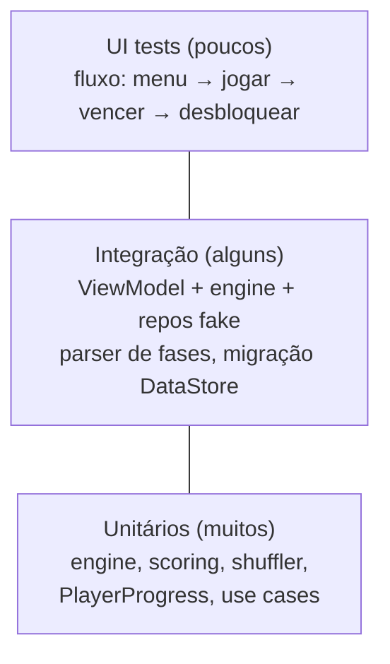

# Qualidade de Código, Testes e DX

## 1. Convenções de código

### 1.1 Idioma (RR-09)
- **Código (classes, funções, variáveis, comentários): inglês.** Hoje coexistem `MusicaFundoPlayer.tocarEmLoop()` e `StageRepository.load()`; padronizar elimina fricção e ambiguidade.
- **Strings visíveis ao jogador: pt-BR via `strings.xml`** (preparando i18n futura). Hoje há textos hardcoded em composables ("Voltar ao menu", "Movimento invalido.", "Combo x…") — mover todos para resources.
- Renomes em PR isolado, sem qualquer mudança de lógica, usando refactor da IDE.

Mapa de renomes principais:

| Atual | Alvo |
|---|---|
| `MusicaFundoPlayer` | `BackgroundMusicPlayer` (`play(track, volume)`, `stop()`, `release()`) |
| `tocarEmLoop/parar/liberar` | `playLooping/stop/release` |
| mensagens de exceção em pt (ex.: "Snapshot invalido…") | inglês |
| chaves `fase.N.*` nos configs | manter compatibilidade até RR-16 (JSON) concluir |

### 1.2 Compose
- Composables **stateless por padrão**: recebem estado + lambdas (`GameScreen(state, onAction)`); state hoisting sempre.
- `@Preview` para todo componente do design system (alimenta screenshot tests).
- Marcar modelos de UI com `@Immutable`/`@Stable`; usar `ImmutableList` no lugar de `List` em estado quente.
- Nada de `LocalContext` para buscar dependências — tudo via ViewModel/DI.

### 1.3 Estrutura
- Um arquivo público por conceito; extensões privadas no fim do arquivo.
- `internal` como visibilidade padrão dentro de módulos (após RR-08).
- Proibido `android.util.Log` direto — usar interface `Logger` injetável (permite silenciar em teste e plugar Crashlytics depois).

## 2. Estratégia de testes

### 2.1 Pirâmide alvo



### 2.2 Fase 1 — Portar os testes do desktop (RR-19, P0)

O desktop já cobre os cenários críticos; portá-los é traduzir intenção, não inventar cobertura:

| Teste desktop (JUnit 4) | Teste mobile alvo (JUnit 5) |
|---|---|
| `GameEngineMatchAndCascadeTest` | `Match3EngineCascadeTest` — matches simples, cascatas encadeadas, frames de queda |
| `GameEnginePontuacaoCascataTest` | `ScoringTest` — 500/1000/1500, multiplicador de cascata, flag `scoreCascade` |
| `GameEngineMoveValidationTest` | `MoveValidationTest` — adjacência, swap que não gera match reverte, posições inválidas |
| `GameEngineSemMovimentosTest` | `ShuffleTest` — `hasAvailableMove`, `shuffleWithoutMatches`, padrão de fallback |
| `BoardTest` + `TestRandom` | `Match3BoardTest` — usar o **seed determinístico** já suportado por `Match3Board(seed=)` |

Padrão de teste da engine (dado o suporte a seed, sem mocks):

```kotlin
@Test
fun `cascade multiplies points per configured multiplier`() {
    val config = stageConfig(cascadeMultiplier = 2, scoreCascade = true)
    val board = boardFrom( // helper que monta o tabuleiro a partir de matriz literal
        """
        1 2 3 4
        2 1 1 3
        1 3 4 2
        """)
    val outcome = Match3Engine(config).tryMoveAnimated(board, Position(1,1), Position(1,0))
    assertEquals(expectedPoints, outcome.points)
}
```

Criar o helper `boardFrom(String)` (equivalente ao `BoardTestUtils` do desktop) — ele é o que torna os testes legíveis.

### 2.3 Fase 2 — Testes de ViewModel (junto de RR-01)

- `runTest` + `StandardTestDispatcher` controlam o tempo virtual: os delays de animação (140/220/65 ms) tornam-se `advanceTimeBy(...)`, permitindo testar a sequência de estados frame a frame com **Turbine**.
- Antes de refatorar o controller: escrever testes de caracterização contra `CoffeeCrushController` atual (tap seleciona → segundo tap troca; movimento inválido mostra mensagem; vitória persiste progresso). Depois da migração, os mesmos testes rodam contra `GameViewModel`.
- Repositórios entram como fakes em memória (não mocks), definidos uma vez em `testFixtures`.

### 2.4 Integração e UI
- Parser de fases: JSON válido, campos faltantes (defaults), schema desconhecido, override em disco vencendo asset.
- Migração SharedPreferences → DataStore: dado um XML de prefs real, o progresso resultante é idêntico (**teste obrigatório antes do release com RR-06**).
- Compose UI tests: fluxo feliz completo e regras de bloqueio de fase.
- Screenshot tests (Roborazzi) para o design system e telas principais — pegam regressão visual de tema/tipografia.

### 2.5 Meta de cobertura
Sem meta numérica global (incentiva teste ruim). Regras práticas: `:core:engine` ≥ 90% (é lógica pura); ViewModels com todos os fluxos de ação cobertos; nenhuma correção de bug sem teste de regressão.

## 3. Análise estática

- **detekt** com `detekt-formatting` (ktlint embutido): estilo + complexidade (limite de tamanho de função/classe teria pego o `TelaInicial` de 2.185 linhas no legado — e protege o mobile de repetir isso).
- **Android Lint** com baseline inicial para não travar o time; zerar a baseline gradualmente.
- Ambos rodando no CI e como task local `./gradlew check`.

## 4. CI/CD (GitHub Actions)

```yaml
# .github/workflows/ci.yml (esqueleto)
on:
  pull_request:
  push: { branches: [main] }
jobs:
  build:
    runs-on: ubuntu-latest
    steps:
      - uses: actions/checkout@v4
      - uses: actions/setup-java@v4
        with: { distribution: temurin, java-version: 17, cache: gradle }
      - run: ./gradlew detekt lint testDebugUnitTest assembleDebug --stacktrace
      - uses: actions/upload-artifact@v4
        if: failure()
        with: { name: reports, path: '**/build/reports' }
```

Evolução: job de release em tag (bundle assinado via secrets), execução de screenshot tests, e macrobenchmark agendado (performance.md §6).

**Nota:** o CI deve rodar na pasta `mobile/coffeecrush-mobile` (usar `working-directory` ou `defaults.run`), já que o repositório raiz é o projeto Ant legado.

## 5. Experiência do desenvolvedor (DX)

| Item | Ação | Ganho |
|---|---|---|
| Higiene de repo (RR-10) | Ignorar `local.properties`, `.gradle-user/`, `.idea/` (exceto configs compartilháveis), `build/` | Sem conflitos falsos, clone limpo |
| Build speed | Gradle configuration cache + build cache ativos em `gradle.properties`; módulos JVM puros (RR-08) compilam sem Android toolchain | Ciclo de feedback menor |
| Previews | Preview para cada tela com dados fake (`PreviewParameterProvider`) | Iterar UI sem emulador |
| Modo debug do jogo | Painel de debug (apenas `debugImplementation`): escolher seed do board, pular fase, +N movimentos, ativar flags locais | Testar gameplay sem grind — essencial para balancear fases |
| Documentação viva | `ARCHITECTURE.md` curto no módulo mobile + ADRs (`docs/adr/NNN-titulo.md`) para decisões (ex.: "por que Compose e não libGDX") | Contexto para humanos e IAs futuras |
| Scripts | `tools/` com scripts de geração de spritesheet já existentes documentados e versionados | Pipeline de assets reprodutível |
| Git hooks (opcional) | pre-commit com ktlint/detekt rápido | Feedback antes do CI |

## 6. Definition of Done (para qualquer tarefa deste plano)

- [ ] Código em inglês, strings de usuário em resources.
- [ ] Testes novos/atualizados passando localmente e no CI.
- [ ] detekt/lint sem novos warnings (baseline não cresce).
- [ ] Sem regressão visual (screenshots) quando tocar em UI.
- [ ] Sem I/O na main thread (verificar com StrictMode em debug).
- [ ] Migrações de dados testadas quando tocar em persistência.
- [ ] Documento correspondente em `docs/improvements/` atualizado se o plano mudou.
