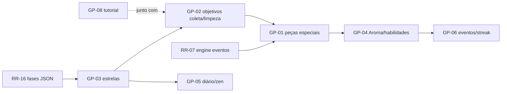

# Gameplay — Análise e Propostas

## 1. Estado atual

Loop único: trocar peças adjacentes → atingir **meta de pontos** antes de acabarem os **movimentos**. Dez fases que variam apenas tamanho do board (6×6→8×8), tipos de peça (5–6), movimentos (20→14) e meta (5k→30k). Sem peças especiais, sem objetivos variados, sem estrelas, sem razão para voltar a uma fase, sem sistemas de retenção.

**Diagnóstico:** o núcleo (match, cascata, pontuação, shuffle) é sólido e testado — o que falta é **variedade de objetivos, ferramentas de expressão (peças especiais/habilidades) e estrutura de progressão**. A dificuldade hoje escala apenas por números, o que vira paredão de grind em vez de novidade.

**Princípio de design:** inspiração no gênero (Candy Crush estabeleceu a gramática), mas identidade própria: aqui o jogador é um **barista em ascensão**, e as mecânicas derivam do universo do café — preparo, pedidos, aroma, torra. Não copiar: nada de "listra/embrulhado/bomba de cor" com outro skin; as especiais abaixo têm comportamentos próprios.

---

## 2. Peças especiais originais — `GP-01` (P1, G)

Criadas ao formar padrões, consumidas ao serem ativadas (tap duplo ou uso em match):

| Peça | Como surge | Efeito | Por que melhora o jogo |
|---|---|---|---|
| **Moedor** ☕⚙️ | Match-4 | Ao ativar, **mói as 8 peças ao redor** transformando-as em "café moído" que é coletado (pontos + conta para objetivos de coleta) em vez de simplesmente destruir | Recompensa match-4 com efeito de área; sinergia direta com objetivos de coleta (§3) |
| **Prensa Francesa** ⬇️ | Match-5 em L/T | **Comprime a coluna inteira**: todas as peças da coluna descem, as de cima esmagam as de baixo gerando pontos, e o topo é preenchido com peças novas — na prática, "rejoga" uma coluna | Efeito espacial único (não é "limpa linha"); cria decisões de posicionamento |
| **Xícara Vazia** 🫗 | Match-5 em linha | Fica no tabuleiro **absorvendo** as peças matched adjacentes por 3 turnos; quando enche, explode em área 3×3 com pontuação proporcional ao que absorveu | Peça de **investimento com timing** — o jogador decide protegê-la ou detonar cedo; não existe equivalente no gênero mainstream |
| **Vapor** 🌫️ | Cascata ≥ 3 níveis (recompensa por cascata, não por padrão!) | Sobe do ponto da cascata **embaralhando suavemente 2 linhas superiores** em novas posições que garantem ≥ 1 match disponível | Transforma cascatas (hoje só pontos) em ferramenta tática; suaviza RNG de topo de board |

Combinações de especiais (ativar uma adjacente à outra) geram efeitos ampliados — projetar tabela de 4×4 combinações na implementação.

**Implementação:** exige RR-16 (config JSON com padrões→peça) e RR-07 (engine por eventos). A engine ganha um passo de "detecção de padrão" após `findMatches` e um sistema de `SpecialActivation` resolvido dentro do loop de cascata.

## 3. Objetivos variados por fase — `GP-02` (P1, G)

Substituir "só meta de pontos" por um **sistema de objetivos combináveis** (1–3 por fase), definidos no JSON da fase:

| Objetivo | Descrição | Tema |
|---|---|---|
| `score` | Meta de pontos (o atual) | — |
| `collect(piece, n)` | Coletar N peças de um tipo via matches | "Pedido do cliente: 20 grãos torrados" |
| `deliver(n)` | **Xícaras de pedido** entram pelo topo e precisam descer até a base (removendo peças abaixo delas) | Entregar o pedido no balcão |
| `clean(cells)` | Células cobertas por **mancha de café** (1–2 camadas); match adjacente/na célula limpa uma camada | Limpar o balcão |
| `unfreeze(cells)` | Peças presas em **açúcar cristalizado**: não se movem até serem quebradas por match adjacente | Obstáculo clássico com skin própria |
| `cascade(n)` | Alcançar N cascatas na fase | Ensina/valoriza a mecânica central |

**Por que melhora:** objetivos variados criam **texturas de puzzle diferentes** com o mesmo motor (coleta = priorizar cor; entrega = abrir caminhos verticais; limpeza = cobertura espacial), e são a base de dificuldade honesta — em vez de só apertar números.

## 4. Medidor de Aroma + habilidades de barista — `GP-04` (P2, G)

Mecânica-assinatura do jogo (sem equivalente direto no gênero):

- Cada match libera **Aroma** que enche um medidor no HUD (xícara/cafeteira).
- Ao encher, o jogador ativa (no momento que quiser) a **habilidade de barista equipada** — escolhida antes da fase, entre as desbloqueadas na progressão:
  - **Torra Perfeita:** converte as peças de um tipo escolhido nas 2 linhas inferiores no tipo mais abundante (setup de cascata manual);
  - **Mão Firme:** os próximos 2 swaps podem ser feitos **sem gerar match** (reposicionamento livre — profundamente estratégico);
  - **Degustação:** revela por 5 s todas as jogadas válidas + a de maior potencial;
  - **Dose Dupla:** o próximo match conta em dobro para objetivos.

**Por que melhora:** dá **agência nos momentos ruins de RNG** (a maior fonte de frustração do gênero), cria identidade ("qual barista você é?"), profundidade de escolha pré-fase e um trilho de progressão de longo prazo (desbloquear/melhorar habilidades). E, futuramente, é superfície natural de monetização cosmética — nunca de pay-to-win (monetization.md §7).

## 5. Estrelas e balanceamento — `GP-03` (P1, M)

- **1 estrela:** cumprir os objetivos; **2:** limiar de pontos; **3:** limiar alto ou terminar com N movimentos sobrando (movimentos restantes viram "shots de espresso" que explodem peças aleatórias com pontos — celebração + incentivo a eficiência).
- Estrelas ficam salvas por fase (`PlayerProgress` ganha `starsByStage`), aparecem no menu/mapa (UX-04) e destravam marcos (habilidades §4, cosméticos).
- **Por que melhora:** replay com propósito, meta de maestria para quem acha a fase fácil, e moeda de progressão sem economia real.

## 6. Modos de jogo — `GP-05` (P2, M–G)

| Modo | Regra | Papel |
|---|---|---|
| **Jornada** | O principal (fases + objetivos + estrelas) | Espinha dorsal |
| **Café da Manhã** (desafio diário) | 1 fase gerada por seed do dia (o suporte a seed **já existe** em `Match3Board`), igual para todos; 3 tentativas | Hábito diário — motor de retenção barato de construir |
| **Modo Zen** | Sem movimentos/meta; só relaxar (opção de encerrar com resumo) | Honra o nome original *sem-stress*; diferencial de marketing real |
| **Contrarrelógio** (futuro) | 90 s, movimentos ilimitados | Sessões curtas, leaderboard futuro |

## 7. Progressão, eventos e retenção — `GP-06` (P2, G)

- **Regiões do mapa** (UX-04b) com tema visual/sonoro: Cafezal → Moagem → Torrefação → Cafeteria → Mestre. Cada região introduz **uma** mecânica nova (curva de aprendizado espaçada — nunca duas novidades na mesma fase).
- **Streak diário:** jogar 1 fase/dia mantém a sequência; recompensas simbólicas crescentes (shots de espresso para o modo diário, cosméticos aos 7/30 dias). Sem punição agressiva por quebra (1 "vale-folga" por semana) — retenção por carinho, não ansiedade.
- **Eventos de fim de semana:** playlist de 5 fases com modificador global (ex.: "Semana da Torra Escura": só 4 tipos de peça, cascatas valem 2×). Baratos: reusam fases existentes + 1 modificador de config remoto.
- **Missões simples** (3/dia): "faça 5 match-4", "use 2 Moedores" — direcionam experimentação das mecânicas.

**Métricas para balancear (com Analytics, frameworks.md §6):** taxa de vitória por fase (alvo 60–80% nas iniciais, 40–60% médias), movimentos restantes ao vencer, ponto de abandono no funil. O painel de debug (code-quality.md §5) com seed fixa é essencial para reproduzir e ajustar fases.

## 8. Tutorial e primeiras sessões — `GP-08` (P1, M)

Fase 1 guiada por overlay (aponta a jogada, sem paredes de texto); mecânicas novas sempre introduzidas numa fase "de aquário" fácil dedicada a ela; hint automático após ~8 s de inatividade (UX-06). A primeira sessão decide a retenção D1 — hoje o jogo abre num grid mudo.

## 9. Ordem de implementação sugerida

Racional: estrelas e objetivos dão profundidade imediata com esforço moderado; peças especiais exigem a engine reformada; Aroma/habilidades coroam o sistema quando a base estiver estável.
