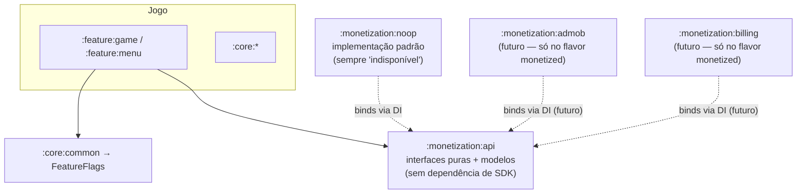
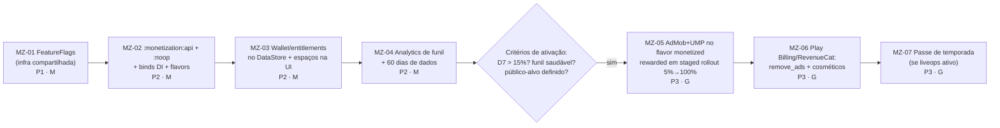

# Monetização — Arquitetura Preparada, Desligada por Padrão

> **Premissa inegociável:** nenhuma funcionalidade de monetização ativa agora. Tudo aqui é projetado para existir como **interfaces + implementações no-op**, ligáveis no futuro **apenas por configuração** (feature flag), sem retrabalho arquitetural. O APK atual não deve sequer conter SDKs de ads/billing até a decisão de ativar.

## 1. Arquitetura recomendada

### 1.1 Princípios

1. **O domínio não conhece monetização.** Engine, ViewModels e use cases dependem apenas de interfaces neutras (`RewardGateway`, `EntitlementsRepository`); nunca de SDKs.
2. **No-op por padrão.** A implementação padrão responde "indisponível/sem direitos" — o jogo funciona 100% sem qualquer SDK.
3. **Ativação por flag + por build.** Duas portas em série: a dependência só entra no APK via flavor/módulo (`monetized`), e só executa se a flag remota/local estiver ligada. Desligar a flag desliga tudo instantaneamente, sem release.
4. **Nunca pay-to-win.** Superfícies de receita: conveniência (movimentos extras via anúncio recompensado), cosméticos, remoção de anúncios, passe de temporada. Jamais vender vitória.

### 1.2 Módulos



### 1.3 Contratos (`:monetization:api`)

```kotlin
interface RewardedAdGateway {
    val isAvailable: StateFlow<Boolean>            // no-op: sempre false
    suspend fun show(placement: AdPlacement): AdResult
}
enum class AdPlacement { EXTRA_MOVES_ON_DEFEAT, DAILY_RETRY, DOUBLE_STARS }
sealed interface AdResult { data object Rewarded : AdResult; data object Dismissed : AdResult; data object NotAvailable : AdResult }

interface EntitlementsRepository {
    val entitlements: Flow<Set<Entitlement>>       // no-op: emptySet()
    suspend fun restore()
}
enum class Entitlement { REMOVE_ADS, SEASON_PASS, COSMETIC_PACK_X }

interface StorefrontGateway {
    suspend fun products(): List<ProductInfo>      // no-op: emptyList()
    suspend fun purchase(productId: String): PurchaseResult
}

interface ConsentManager {                          // UMP/consentimento (só no flavor monetized)
    suspend fun ensureConsent(activity: Activity): ConsentState
}
```

A UI reage a `isAvailable`/`entitlements`: se o gateway no-op diz "não disponível", **o botão nem aparece** — o design das telas já reserva o espaço (ex.: tela de derrota), mas o elemento é condicional.

### 1.4 Feature flags (infraestrutura compartilhada)

```kotlin
interface FeatureFlags { fun isEnabled(flag: Flag): Boolean; val updates: Flow<Unit> }
enum class Flag(val default: Boolean) {
    MONETIZATION_MASTER(false),      // interruptor geral
    REWARDED_ADS(false),
    IAP_STORE(false),
    SEASON_PASS(false),
    // flags técnicas reutilizam a mesma infra:
    NEW_BOARD_RENDERER(false),
}
```

Implementações em cadeia (a primeira que responder vence): `DebugOverrideFlags` (painel debug) → `RemoteConfigFlags` (Firebase, quando existir) → `DefaultFlags` (constantes, tudo `false`). Essa infraestrutura serve também aos rollouts técnicos (RR-20, RR-07) — construí-la primeiro (MZ-01) beneficia o projeto inteiro antes de qualquer centavo.

**Feito em MZ-01:** módulo `:core:common` (Kotlin JVM puro, sem Android SDK) com `Flag`/`FeatureFlags`/`MutableFeatureFlags` e uma única implementação `DefaultFeatureFlags` (in-memory, thread-safe) que já resolve o papel de `DebugOverrideFlags` + `DefaultFlags` — como `RemoteConfigFlags` ainda não existe (depende de Firebase, fora de escopo aqui), o "override" só é escrito pelo painel de debug (CQ-03); nada mais no app grava nele hoje. `FeatureFlags`/`MutableFeatureFlags` são bindados via Hilt em `DataModule` (`:app`), disponíveis em qualquer build type. Quando `RemoteConfigFlags` existir, ele entra como uma segunda fonte consultada por `DefaultFeatureFlags` antes do `default` do enum, sem mudar a interface pública.

## 2. Frameworks/SDKs sugeridos (para o futuro flavor `monetized`)

| Função | SDK | Observações |
|---|---|---|
| Rewarded ads | **Google AdMob** | Padrão Android; começar só com rewarded (formato de melhor aceitação). Alternativa de mediação (AppLovin MAX) apenas se escala justificar. |
| Consentimento | **UMP (User Messaging Platform)** | Obrigatório com AdMob; cobre LGPD/GDPR forms. |
| Compras | **Play Billing Library** | IAP e assinaturas no Android. |
| Camada sobre billing | **RevenueCat** (opcional, recomendado) | Abstrai recibos/entitlements/restore, dashboard, e simplifica muito um futuro iOS (StoreKit) — alinhado à opção KMP de ideas.md. |
| Flags | **Firebase Remote Config** | Backend das flags; a interface local (§1.4) vem antes e não depende dele. |
| Métricas | Firebase Analytics + Crashlytics | Pré-requisito de fato para decidir *quando* ativar monetização (ver §8). |

## 3. Pontos de integração no jogo

| Ponto | Mecânica | Flag | Regra de UX |
|---|---|---|---|
| Tela de derrota (UX-07) | Rewarded: "+5 movimentos" (1× por partida) | `REWARDED_ADS` | Opcional, claro, nunca automático; perder continua ok |
| Desafio diário (GP-05) | Rewarded: tentativa extra após esgotar as 3 | `REWARDED_ADS` | Idem |
| Vitória | Rewarded: "dobrar shots de espresso" (bônus cosmético de celebração, não progresso) | `REWARDED_ADS` | Nunca condicionar as estrelas a anúncio |
| Loja (tela nova) | IAP: `remove_ads`, pacotes cosméticos (temas de tabuleiro/skins de peças/trilhas), passe de temporada | `IAP_STORE`, `SEASON_PASS` | Só cosmético/conveniência; preços claros; restore visível |
| Configurações | "Restaurar compras", link de privacidade, revogar consentimento | master | Exigência das lojas |

**Fora do escopo por decisão:** interstitials entre fases (destroem o "sem stress" da marca) e banners (poluem um jogo de tabuleiro). Se algum dia entrarem, apenas para não-pagantes, nunca durante gameplay, atrás de flag própria.

## 4. Impacto na arquitetura atual

| Mudança | Dependência | Custo |
|---|---|---|
| Criar `:monetization:api` + `:noop` + bind no DI | RR-05 (Hilt), RR-08 (módulos) | P — são interfaces e stubs |
| `FeatureFlags` em `:core:common` | RR-05 | P/M |
| `PlayerWallet`/inventário leve (shots de espresso, cosméticos possuídos) no DataStore | RR-06 | M — necessário de todo modo para GP-03/GP-06 |
| Espaços condicionais nas telas de derrota/vitória/loja | UX-07 | P — design já prevê |
| Flavor `monetized` vs `free` (dimensão de produto) | RR-11 | P — o flavor `free` (padrão) não compila SDKs |
| Analytics de funil (base de decisão) | frameworks.md §6 | M |

Nada disso conflita com o roadmap técnico — ao contrário: flags, wallet e entitlements reutilizam DataStore/DI/flags já planejados.

## 5. Cuidados com experiência do usuário

- Rewarded **sempre opt-in**, com recompensa explícita antes de abrir; falha de carregamento nunca bloqueia o fluxo (botão simplesmente não aparece).
- Frequency cap (ex.: máx. 3 rewarded/dia por jogador) mesmo sendo opt-in — proteger a percepção de qualidade.
- Loja sem dark patterns: sem timers de escassez falsos, sem moedas confusas de conversão dupla; preço real visível.
- Passe de temporada com trilha gratuita paralela sempre presente.
- Jogador pagante de `REMOVE_ADS` nunca vê superfície de anúncio alguma (nem os botões de rewarded — oferecer a recompensa direto ou nada, decidir em teste).
- Offline: tudo funciona sem rede; monetização simplesmente não aparece.

## 6. Conformidade — LGPD e lojas

**LGPD (e GDPR, se distribuir fora do Brasil):**
- Consentimento explícito **antes** de qualquer coleta para ads personalizados (UMP); oferecer opção de anúncios não personalizados; registrar e permitir revogação nas configurações.
- Política de privacidade acessível no app e na ficha da loja (obrigatória mesmo hoje, com Analytics/Crashlytics).
- Minimização: não coletar dados além do necessário; sem conta de usuário não há dado pessoal direto — manter assim o máximo possível.
- **Crianças:** match-3 atrai menores. Se a classificação/target incluir crianças: Play Families Policy (ads certificados, sem personalização), COPPA se distribuir nos EUA, e tratamento LGPD específico para menores (consentimento parental para dados). A decisão de público-alvo deve ser tomada **antes** de ativar ads — ela restringe SDKs e formatos permitidos.

**Google Play:** declaração de Data Safety coerente com os SDKs embarcados (motivo extra para não embarcar SDK antes da hora); billing exclusivamente via Play Billing; declaração de conteúdo/ads na ficha; classificação IARC.

**App Store (futuro iOS):** ATT (App Tracking Transparency) antes de qualquer tracking; IAP via StoreKit (RevenueCat ajuda); privacy nutrition labels.

## 7. Estratégias recomendadas para ESTE jogo (e quando)

Ordenadas por adequação à marca "sem stress" + esforço:

1. **Rewarded ads (primeira a ativar).** Melhor razão valor/atrito do gênero: o jogador escolhe, recebe valor claro (+5 movimentos), e monetiza a base gratuita sem tocar no game design. Requer apenas AdMob + UMP + os pontos §3.
2. **Remove ads (IAP única, junto com a 1ª).** Barata de implementar (`Entitlement.REMOVE_ADS`), sinaliza respeito, e converte quem odeia anúncio. Só faz sentido simultânea aos rewarded.
3. **Cosméticos (segunda onda).** Temas de tabuleiro/skins/trilhas sonoras — a identidade café dá vitrine natural ("tema Cafeteria de Outono"). Depende de UX-01 (design system com temas plugáveis). Margem alta, zero impacto de balanceamento.
4. **Passe de temporada (apenas com liveops maduro).** Exige eventos/missões (GP-06) rodando de verdade e cadência mensal de conteúdo. Não ativar antes — passe sem conteúdo mata retenção.
5. **Não recomendadas para este jogo:** vidas/energia (anti-tese do "sem stress"), loot boxes (risco regulatório e reputacional), interstitials (ver §3).

## 8. Roadmap de implementação



**Critérios de gate (não ativar antes):** retenção D7 > ~15%, tamanho de base que justifique operação, política de público/privacidade publicada, e teste interno completo do fluxo de consentimento. Monetizar um jogo sem retenção só acelera o churn.

## 9. Checklist de conformidade pré-ativação

- [ ] Decisão formal de público-alvo (inclui crianças? → restrições de SDK/formato)
- [ ] Política de privacidade publicada e linkada no app + loja
- [ ] UMP integrado e testado (aceite, recusa, revogação)
- [ ] Data Safety da Play preenchida e coerente com SDKs do APK
- [ ] `REMOVE_ADS` remove 100% das superfícies
- [ ] Restore de compras funcional em reinstalação/troca de aparelho
- [ ] Flags testadas: desligar `MONETIZATION_MASTER` remove tudo sem crash
- [ ] Frequency caps implementados e logados
- [ ] Teste de compra em faixa interna da Play com cartões de teste
