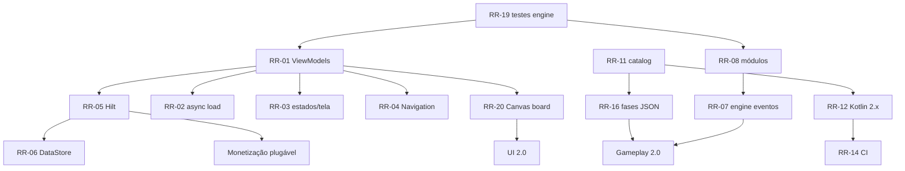

# Roadmap de Refatoração

Consolida **todos os problemas encontrados** na análise, com impacto, solução, esforço, prioridade, dependências e riscos. A execução consolidada (com critérios de aceite) está em [backlog.md](backlog.md); o racional arquitetural em [architecture.md](architecture.md).

Legenda: prioridade `P0..P3`; esforço `P` (≤ ½ dia), `M` (1–3 dias), `G` (≥ 1 semana). "Dep." referencia outros itens `RR-nn`.

---

## 1. Tabela mestre de problemas

### Fundação e toolchain

| ID | Problema | Impacto | Solução recomendada | Esf. | Prio. | Dep. | Riscos da mudança |
|---|---|---|---|---|---|---|---|
| RR-10 | Arquivos locais versionados: `local.properties`, `.gradle-user/`, `.idea/` parcial | Vazamento de paths locais, conflitos de merge, repo sujo | Adicionar ao `.gitignore` e remover do índice (`git rm --cached`) | P | P0 | — | Nenhum |
| RR-11 | Sem version catalog; versões espalhadas em strings nos `build.gradle.kts` | Upgrades manuais, inconsistência entre módulos futuros | Criar `gradle/libs.versions.toml` e migrar todas as dependências | P | P0 | — | Nenhum |
| RR-12 | Kotlin 1.9.24 + `kotlinCompilerExtensionVersion` fixado (1.5.14) | Preso a APIs antigas; Compose compiler desacoplado do Kotlin é modelo legado | Migrar para Kotlin 2.x + plugin `org.jetbrains.kotlin.plugin.compose` (remove a versão manual do compiler); atualizar AGP e Compose BOM na sequência | M | P0 | RR-11 | Ajustes menores de API; rodar suíte completa após upgrade |
| RR-13 | `isMinifyEnabled = false` no release; sem shrink de recursos | APK maior, sem ofuscação, esconde problemas de keep rules até tarde demais | Habilitar R8 + `isShrinkResources`, escrever regras keep mínimas, testar release build | P | P1 | RR-12 | Crashes por regra keep faltante → mitigar com teste de release em CI |
| RR-14 | Sem CI | Regressões silenciosas; qualidade depende de disciplina manual | GitHub Actions: build + lint + detekt + testes em cada PR (ver code-quality.md) | M | P0 | RR-11 | Nenhum |
| RR-15 | Manifest mínimo: sem `android:icon`, sem lock de orientação, sem splash | App sem ícone próprio na launcher; rotação destrói partida (agravado por RR-01); cold start feio | Ícone adaptativo, `screenOrientation="portrait"` na Activity do jogo, `androidx.core:core-splashscreen` | P | P1 | — | Nenhum |

### Estado, ciclo de vida e dados

| ID | Problema | Impacto | Solução recomendada | Esf. | Prio. | Dep. | Riscos da mudança |
|---|---|---|---|---|---|---|---|
| RR-01 | `CoffeeCrushController` não é ViewModel: scope próprio nunca cancelado, vive em `remember{}` | Partida perdida em rotação/process death; vazamento de coroutines; intestável | Converter em `MenuViewModel` + `GameViewModel` (`StateFlow`, `viewModelScope`, `SavedStateHandle`); UI só coleta estado e envia ações | G | **P0** | RR-19 (testes antes) | Regressão sutil no timing das animações → cobrir com testes de comportamento antes de mover |
| RR-02 | I/O síncrono na composição (`StageRepository.load()`, `ProgressRepository.load()` na main thread) | Jank no primeiro frame; risco de ANR em devices lentos; escala mal com mais fases | Carregar em `viewModelScope` com `Dispatchers.IO`; UI exibe estado `Loading` (splash/skeleton) | M | **P0** | RR-01 | Baixo |
| RR-03 | Deus-estado `AppUiState` (navegação + catálogo + música + partida num único `mutableStateOf`) | Recomposição ampla; acoplamento entre telas; difícil raciocinar | Um `UiState` por tela/ViewModel; estado de música em `SettingsRepository` compartilhado | M | P0 | RR-01 | Baixo |
| RR-04 | Navegação via `when(state.screen)` | Sem back stack (botão voltar fecha o app), sem transições, sem deep link, sem args tipados | Navigation Compose com rotas type-safe (`@Serializable data class Game(val stageId: Int)`) | M | P1 | RR-01 | Comportamento do back precisa de teste manual (sair da partida deve pedir confirmação — ver UX-09) |
| RR-05 | Sem injeção de dependência (wiring manual na Activity) | Duplicação, dificuldade de trocar fakes em teste, crescimento desordenado | Hilt (`@HiltViewModel`, módulos por camada) | M | P1 | RR-01 | Curva de aprendizado; erros de grafo aparecem em compile time (bom) |
| RR-06 | `SharedPreferences` síncrono para progresso | Sem Flow (menu não reage a mudanças), sem transação, sem migração estruturada | Proto DataStore com `SharedPreferencesMigration` preservando chaves atuais | M | P1 | RR-05 | **Perda de progresso do jogador se a migração falhar** → testar migração com prefs reais copiadas do app atual |
| RR-16 | Config de fases em `.properties` (chato de evoluir: sem listas/aninhamento/tipos) | Bloqueia gameplay 2.0 (objetivos, obstáculos, camadas por célula) | Migrar para JSON + kotlinx.serialization com schema versionado (`schemaVersion`); manter override local; fallback temporário p/ properties | M | P1 | RR-11 | Erros de parsing → validação com mensagens claras + testes de parser |
| RR-09 | Idioma misto no código (pt/en em nomes de classes, funções, mensagens) | Fricção de leitura, inconsistência, pior para ferramentas e colaboradores | Padronizar **código 100% em inglês**; strings de usuário 100% em `strings.xml` pt-BR (hoje há textos hardcoded como "Voltar ao menu") | M | P2 | — | Renomes amplos → fazer com IDE/refactor automático, em PR isolado sem mudanças de lógica |

### Engine e domínio

| ID | Problema | Impacto | Solução recomendada | Esf. | Prio. | Dep. | Riscos da mudança |
|---|---|---|---|---|---|---|---|
| RR-19 | **Zero testes no módulo mobile** (desktop tem 6 suítes de engine; mobile nenhuma) | Qualquer refatoração é às cegas; é o desbloqueador de todo o resto | Portar testes JUnit4 do desktop para JUnit5/Kotlin em cima de `Match3Engine` (mesmos cenários: match/cascata, pontuação, validação de movimento, sem-movimentos/shuffle, semente determinística) | M | **P0** | — | Nenhum; é rede de segurança |
| RR-07 | Engine mistura domínio com apresentação (`AnimationRound` com snapshots completos por frame) | Alocação alta (List<List<Int>> por frame), acoplamento conceitual | Fase 1: manter API, mas documentar; Fase 2: engine emite **eventos semânticos** (`Cleared(positions)`, `Fell(from,to)`, `Spawned(pos,piece)`) e a UI interpola — pré-requisito para animações fluidas de queda (UX-05) | G | P2 | RR-19, RR-01 | Mudança de contrato de animação → feature flag interna para alternar pipelines durante a transição |
| RR-08 | Monólito `:app` | Build lento com o crescimento; sem fronteiras impostas | Extrair `:core:engine` e `:core:model` como módulos Kotlin JVM puros; depois `:core:data`, `:core:ui`, features | G | P2 | RR-11, RR-19 | Baixo se feito após testes |
| RR-17 | `Match3Board` mutável compartilhado entre engine e controller; `snapshot()` cria listas novas a cada sync | Bugs de aliasing em refactors; pressão de GC | Na etapa RR-07, tornar o board interno à engine e expor estados imutáveis (`ImmutableList`/arrays encapsulados) | M | P2 | RR-07 | Médio; coberto pelos testes |

### UI/render/áudio (resumo — detalhes em performance.md e ui-ux.md)

| ID | Problema | Impacto | Solução recomendada | Esf. | Prio. | Dep. | Riscos |
|---|---|---|---|---|---|---|---|
| RR-20 | Ticker de sprite global recompõe o tabuleiro inteiro a cada 80 ms; 4 `animateFloatAsState` por célula | Jank e bateria; escala mal em 8×8 | Redesenhar o board como **um único `Canvas`** com `drawImage` por célula e frame do sprite lido em `drawScope` (sem recomposição) — ver performance.md §2 | G | P1 | RR-01 | Reimplementar seleção/drag no Canvas; cobrir com testes de UI |
| RR-21 | Sprites: 12 PNGs por item decodificados sem downsampling; cache singleton global mutável | Memória alta em telas grandes, estado global escondido | Spritesheet única por item + downsample para o tamanho real da célula; cache injetado via DI com escopo de app | M | P1 | RR-05 | Baixo |
| RR-22 | Sem efeitos sonoros (só música); `MediaPlayer` recriado a cada troca de faixa | Feedback pobre; latência | `SoundPool` para SFX (match, combo, vitória); música com `MediaPlayer`/Media3 mantido + fade | M | P2 | — | Baixo |
| RR-23 | Acessibilidade ausente (imagens com `contentDescription = null`, tabuleiro sem semântica, sem suporte a TalkBack) | Exclui jogadores; risco de rejeição em reviews de loja | Ver ui-ux.md §8 (semântica por célula, alternativa às cores, touch targets, contraste) | M | P2 | RR-20 | Baixo |

---

## 2. Roadmap em fases

```mermaid
gantt
    dateFormat X
    axisFormat Fase %s
    section Fase 0 — Higiene (P0, ~1 semana)
    RR-10 gitignore/limpeza           :0, 1
    RR-11 version catalog             :0, 1
    RR-12 Kotlin 2.x + Compose plugin :1, 2
    RR-14 CI básico                   :1, 2
    section Fase 1 — Rede de segurança
    RR-19 testes de engine            :2, 3
    section Fase 2 — Estado e dados (P0/P1)
    RR-01 ViewModels                  :3, 5
    RR-02 carregamento assíncrono     :4, 5
    RR-03 estados por tela            :4, 5
    RR-04 Navigation Compose          :5, 6
    RR-05 Hilt                        :5, 6
    RR-06 DataStore + migração        :6, 7
    RR-16 fases em JSON               :6, 7
    section Fase 3 — Render e release
    RR-20 board em Canvas             :7, 9
    RR-21 sprites otimizados          :7, 8
    RR-13 R8/minify                   :8, 9
    RR-15 ícone/splash/orientação     :8, 9
    section Fase 4 — Estrutura
    RR-08 modularização               :9, 11
    RR-07 engine orientada a eventos  :10, 12
    RR-09 padronização de idioma      :9, 10
    section Fase 5 — Produto
    Gameplay 2.0 (gameplay.md)        :11, 14
    UI 2.0 (ui-ux.md)                 :11, 14
    Monetização plugável (monetization.md) :13, 15
```

### Grafo de dependências entre os itens críticos

---

## 3. Estratégia de risco geral

1. **Nunca refatorar sem rede:** RR-19 (testes de engine) vem antes de qualquer mudança estrutural; para o controller, escrever testes de caracterização do comportamento atual antes de RR-01.
2. **PRs pequenos e temáticos:** um item RR por PR; renomes (RR-09) jamais misturados com lógica.
3. **Dados do jogador são sagrados:** RR-06 exige teste de migração automatizado + rollback plan (manter leitura das prefs antigas por 2 versões).
4. **Comparação com o oráculo:** enquanto houver dúvida de regra (pontuação de cascata, shuffle), o comportamento do desktop + seus testes decidem.
5. **Feature flags para transições arriscadas:** pipeline de animação novo (RR-07/RR-20) atrás de flag local até estabilizar — a mesma infraestrutura de flags que a monetização usará (monetization.md §3).
